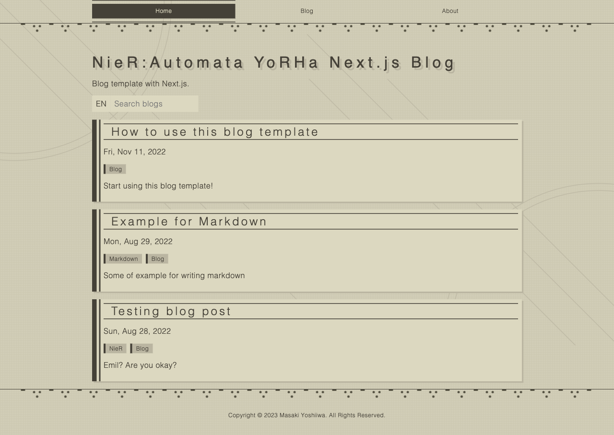

# NieR:Automata YoRHa Next.js Blog template

## Elements

- [Next.js](https://nextjs.org/)
- [Emotion](https://emotion.sh/docs/introduction)
- [Markdown](https://www.markdownguide.org/cheat-sheet/)

## Live demo

https://next-playground.vercel.app



---

# Development

There are two ways to set up a local development environment.
Read below and choose the one you prefer.

### Setup with Node.js

Please install Node.js (v18.x) first.

After installation is complete, follow the steps below:

```sh
npm i

npm run dev
```

Access following link to check the app is working:

http://localhost:3000/

### Setup with Docker Compose

Please install Docker first.

After installation is complete, execute the command below:

```sh
docker-compose up
```

After a while, access following link to check the app is working:

http://localhost:3000/

### Setup with devcontainer

The above setup can be used for development, but you can also setup dev env with using the [VS Code Dev Containers extension](https://marketplace.visualstudio.com/items?itemName=ms-vscode-remote.remote-containers).

- Install VS code and the [Dev Containers extension](https://marketplace.visualstudio.com/items?itemName=ms-vscode-remote.remote-containers).
- [Optional] To share git credential with the container, run `ssh-add $HOME/.ssh/your_ssh_rsa`. See following for more info: https://code.visualstudio.com/remote/advancedcontainers/sharing-git-credentials
- Run the `Dev Containers: Open Folder in Container...` command from the Command Palette or quick actions Status bar item, and select the project folder.
- Wait until the building of the application is finished, then access the application url

## E2E Testing

The E2E testing is executed by [Playwright Test](https://playwright.dev/).

Detailed in `playwright.config.ts` and `e2e-test/e2e-test.spec.ts`.

To run the E2E test, do the following:

```sh
npx playwright test
```

Or

```sh
npm run test:e2e
```

See [Playwright Docs](https://playwright.dev/docs/intro) for more details.

---

# Production

## Update site metadata

Update the following file, which contains the site name and other metadata.

`constants/siteMetadata.ts`

## Update or add your own contents

To update the contents of your own blog, you can update the contents in `contents/blog`.

You can write blogs in markdown by referring to the following:

https://www.markdownguide.org/cheat-sheet/
